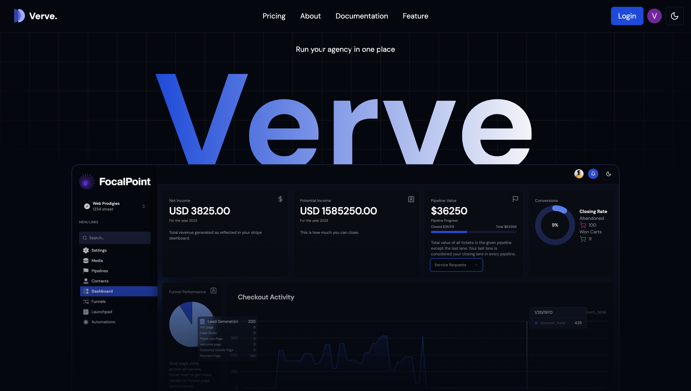

# Verve - SaaS Website Builder & Project Management Dashboard 
#### Built With NextJs14 using Stripe, Bun, Prisma, MySQL & Tailwind




### Features
-  Agency and Sub accounts
-  Funnels - Full website builder
- Drag & drop funcitonality 
-  Role-based Access
- Payment integration with stripe
- Stripe-synced dashboard
-  Media Storage
-  Khanban board - for pipeline managemnent
-  Project management system
-  Notifications
-  Graphs and charts
-  Light & Dark mode
-  Functioning landing page


### Setup Instructions
Run the following in terminal
```bash
git clone https://github.com/vansh2308/website-builder-saas.git
cd ./website-builder-saas
bun install 
```
Setup your .env file 
```
NEXT_PUBLIC_CLERK_PUBLISHABLE_KEY=
CLERK_SECRET_KEY=
NEXT_PUBLIC_CLERK_SIGN_IN_URL=
NEXT_PUBLIC_CLERK_SIGN_UP_URL=
NEXT_PUBLIC_CLERK_AFTER_SIGN_IN_URL=
NEXT_PUBLIC_CLERK_AFTER_SIGN_UP_URL=
DB_USERNAME=
DB_PASSWORD=

NEXT_PUBLIC_URL=
NEXT_PUBLIC_DOMAIN=
NEXT_PUBLIC_SCHEME=

UPLOADTHING_SECRET=
UPLOADTHING_APP_ID=

NEXT_PUBLIC_STRIPE_PUBLISHABLE_KEY=
STRIPE_SECRET_KEY=
STRIPE_WEBHOOK_SECRET=
NEXT_PUBLIC_STRIPE_CLIENT_ID=
NEXT_PUBLIC_PLATFORM_SUBSCRIPTION_PERCENT=1
NEXT_PUBLIC_PLATFORM_ONETIME_FEE=2
NEXT_PUBLIC_PLATFORM_AGENY_PERCENT=1
NEXT_PLURA_PRODUCT_ID=
DATABPASE_PASSWORD=


DATABASE_URL=
PROD_DATABASE_URL=
LOCAL_DATABASE_URL=

NEXT_PUBLIC_BUILDER_API_KEY=
```

Open terminal and issue:
```
bun run dev
```

Voila ;) Just type in http://localhost:3000 in your browser!


### Author
- Github - [vansh2308](https://github.com/vansh2308)
- Website - [Vansh Agarwal](https://portfolio-website-self-xi.vercel.app/)
- Frontend Mentor - [@vansh2308](https://www.frontendmentor.io/profile/vansh2308)